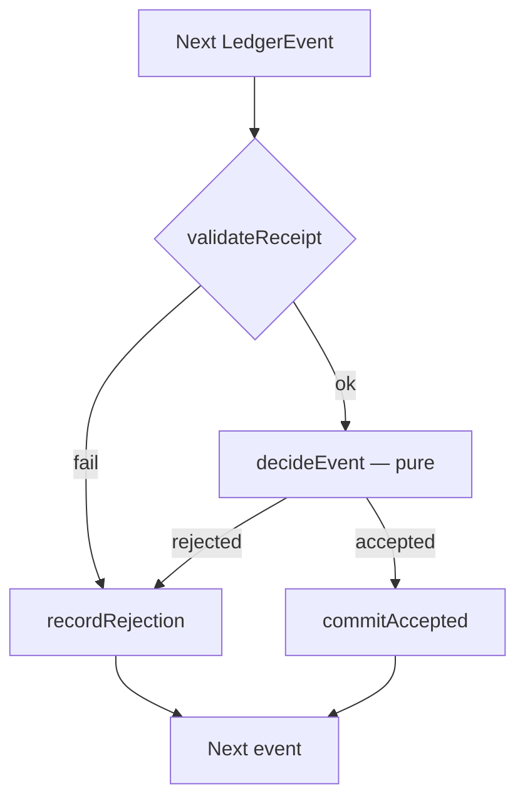
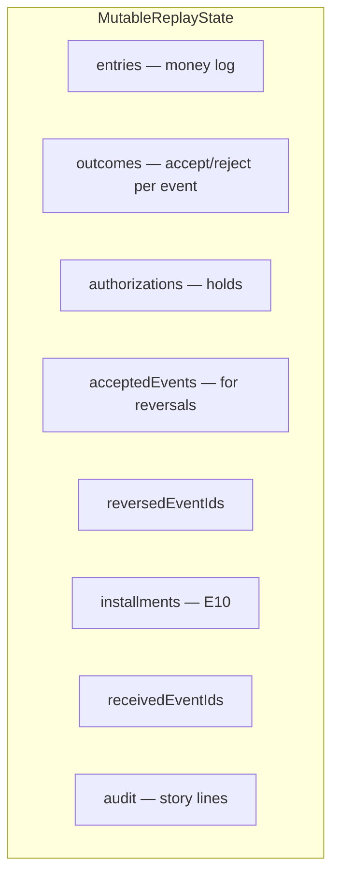

# Architecture & Trade-offs

Balances are a fold over an append-only log. Nothing is updated in place.

```
Events → Validate → Decide (pure) → Commit once → AccountView[] (derived)
```

**Event** = stream input. **Outcome** = accepted or rejected. **LedgerEntry** = posted money. **AccountView** = per-account report after replay.

Posted = opening + ledger entries. Available = posted − open holds. Fees and interest are extra entries.

---

## 1. Code map — who owns what

| Role | File | Responsibility |
| ---- | ---- | -------------- |
| Entry | `src/index.ts` | `replay` → `buildReport` → stdout |
| Fixture | `src/data/sampleEvents.ts` | ACC-001/002 + E1–E10 |
| Conductor | `src/engine/replayEngine.ts` | Loop; own state; only commit writes |
| Judge | `src/engine/eventProcessor.ts` | Pure `decideEvent` switch; no mutation |
| Fee desk | `src/engine/feeAssessor.ts` | Debit → AED 25 on negative days |
| Balances | `src/engine/balanceCalculator.ts` | Posted / available / day close |
| Interest | `src/engine/interestCalculator.ts` | 0.04% on positive closes |
| Split | `src/engine/installmentAllocator.ts` | Conserve installment totals |
| Printer | `src/engine/reportBuilder.ts` | Format `ReplayResult` only |

**How to follow one event:** `applyEvent` → `validateReceipt` → `decideEvent` → `commitAccepted` or `recordRejection`. Reject never writes entries or holds. After E1–E10: `buildAccountViews` → report.

---

## 2. Append-only at scale

**Grows without bound:** event log, auth index, reversal IDs, fee keys, daily-balance rescans.

**Breaks first:** rebuild six days from event zero on every request.

**Cheapest fix:** checkpoint per account/day (last event, posted, open holds). Replay the tail. Log stays truth.

---

## 3. One event — control flow



`decideEvent` returns a plan only. `commitAccepted` is the only money writer.

---

## 4. MutableReplayState — memory bags



`entries` is the money source of truth. Only `commitAccepted` / `recordRejection` mutate during the loop (interest may append at the end).

---

## 5. Value-dated entries in production

| Clock | Meaning |
| ----- | ------- |
| Event day | When learned (as-observed filters by `receivedDay`) |
| Value date | Accounting day (restated uses `valueDate`) |

Late back-value can restate a shipped day. **Control:** maker-checker + evidence → new compensating entry only. Cutoffs + recon. Engine has both views; not yet approval/calendars.

---

## 6. Authorization lifecycle

```
          OPEN
         /    \
        v      v
   SETTLED   RELEASED
 matching    expiry / void /
 settlement  cancel / ops
```

Bad settlement → reject, hold unchanged. Other endings = append-only release once.

---

## 7. What was cut — risk deferred

| Cut | Risk deferred |
| --- | ------------- |
| No disk / API / locks | Data loss, authn, double-spend |
| No bank network / FX | Duplicates, recon, cross-currency |
| Day 1–6 / no expiry | Holidays, TZ, stale holds |
| No signing / fee auto-reverse | Tamper; fee left after debit |

**Live sequence:** durable log + checkpoints → expiry/release + idempotent commands → maker-checker with signing and recon.
